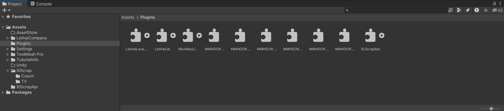
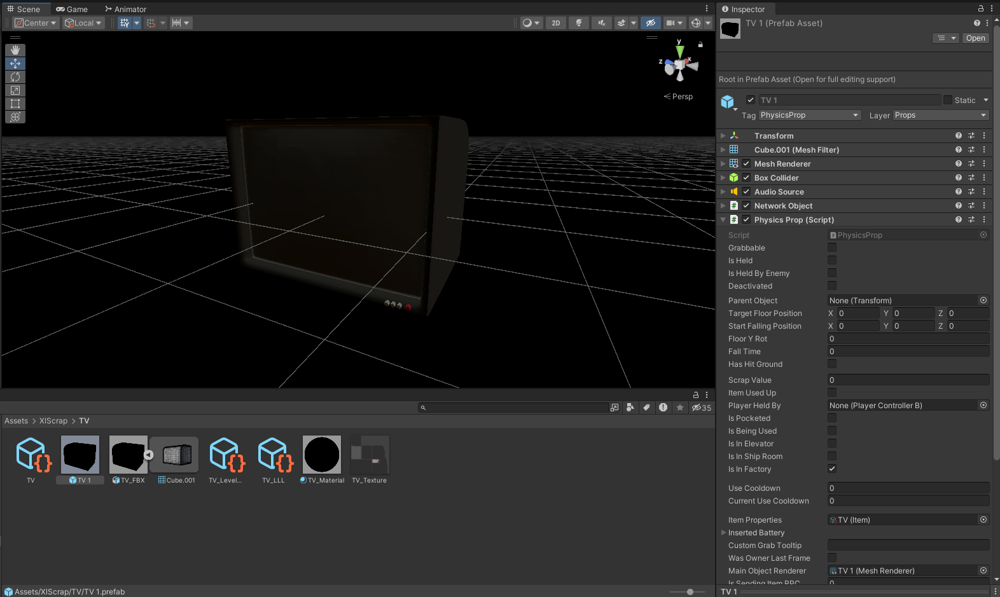
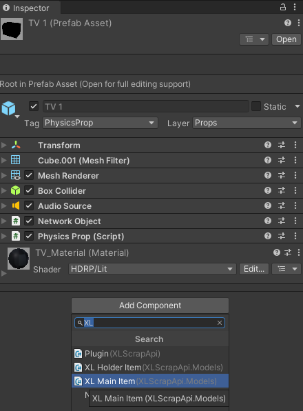
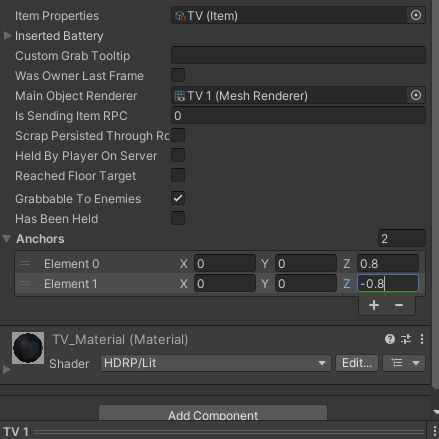
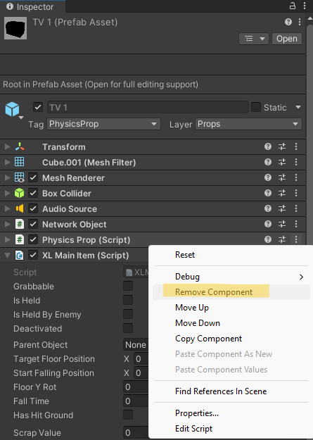

## Preface

This tutorial assumes you are working with a pre-existing custom item;
it is suggested you follow a guide on making a normal custom item if you do not know how to make one first.

Though this example will modify an item added via Lethal Level Loader, you should be able to do the same with other libraries like Lethal Lib.

## Converting to an XL Main Item

* Ensure that you have the XL Scrap API correctly imported into your Unity project.
This will be required by Unity so that it is able to register the "XL Main Item" component correctly for you to add in the next step.

* Navigate to the prefab of your custom item, and add the "XL Main Item" component.
This should look extremely similar in structure to the default "Grabbable Object" and "Physics Prop" components.
* Copy over all relevant properties to the newly created component in preparation to remove it.

* Near the bottom of our component, you will find the "Anchors" property.
Here, you will want to specify the co-ordinates (relative to the main object's) of the points that the holder items will spawn in for the player to grab with.
It is recommended to make use of another object here to gauge accurate values for these anchor points; 
it will likely come down to trial and error when determining the values by feel anyway.
Note that the first anchor point will be what the object's `transform.forward` will be set to at runtime;
this may require careful placement, or adjusting the mesh in Blender or a similar tool if the item's shape is not regular.

You should now be able to build the asset bundle and register it using a library as you would with a regular custom item!
